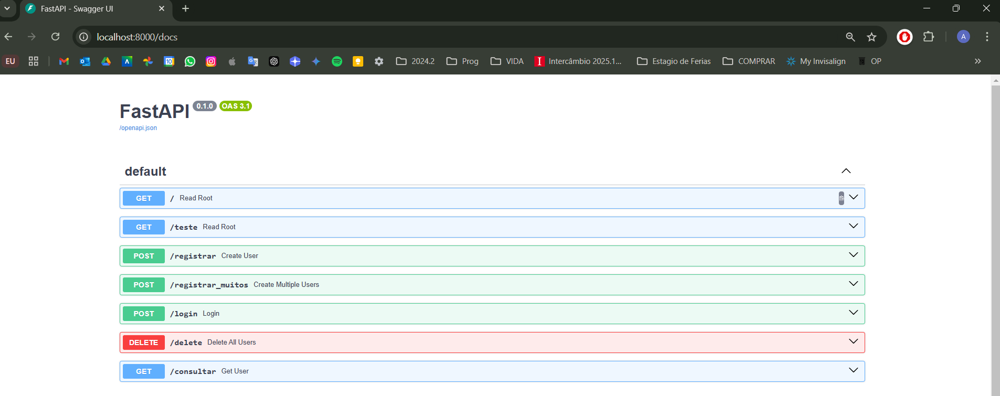

# Projeto Cloud - FastAPI e PostgreSQL

### Nome do Aluno:
Albert David Hamoui
---

# 🐳 Docker

## Descrição do Projeto (Docker)
Este projeto implementa uma API utilizando **FastAPI**, com autenticação via **JWT** e integração com um banco de dados **PostgreSQL**. A API oferece funcionalidades para registro e autenticação de usuários, além de consultas a notícias de um site externo (**The Independent**). O projeto também utiliza **Docker** para containerização e **Docker Compose** para orquestração.

## 🚀 Como Executar a Aplicação

### ✅ Pré-requisitos
- Docker e Docker Compose instalados.
- Clonar este repositório:
  ```bash
  git clone https://github.com/alberthamoui/projetoCloud.git
  ```
- Navegar até o diretório do projeto:
  ```bash
  cd <nome-do-diretorio>
  ```

### 🔧 Configuração
#### 1. Crie um arquivo `.env` com as variáveis de ambiente necessárias:
    ```bash
    POSTGRES_DB=nome_do_banco
    POSTGRES_USER=usuario
    POSTGRES_PASSWORD=senha
    DATABASE_URL=postgresql://nome:nome@db:5432/nome
    SECRET_KEY="chave_super_secreta"
    ```


#### 2. Execute o projeto com Docker Compose:
    ```bash
    docker-compose up -d
    ```

### 💻 Uso da Aplicação
#### 1. Acesse a aplicação em `http://localhost:8000`.
#### 2. Utilize as rotas da API conforme a documentação abaixo.
#### 3. Extra: Para testar a conexão com o banco de dados, execute o arquivo `teste.py`.


---

## 📚 Documentação dos Endpoints da API
### `POST /registrar`
- **Descrição:** Registra um novo usuário.
- **Entrada:** JSON com `email` e `senha`.
- **Saída:** Token JWT gerado para o usuário registrado.

### `POST /login`
- **Descrição:** Autentica o usuário e retorna um Token JWT.
- **Entrada:** JSON com `email` e `senha`.
- **Saída:** Token JWT.

### `GET /consultar`
- **Descrição:** Retorna as manchetes de notícias do site *The Independent*.
- **Cabeçalho necessário:** Token JWT no formato `Bearer <token>`.
- **Saída:** Lista de 10 manchetes.

### `DELETE /delete`
- **Descrição:** Deleta todos os usuários cadastrados.
- **Entrada:** Nenhuma.
- **Saída:** Mensagem de confirmação.

---

## 📸 Screenshot dos Endpoints Testados
Aqui está uma captura de tela com os testes realizados:



---

## 🎥 Vídeo de Execução da Aplicação
Veja o vídeo demonstrativo da execução do projeto:
[Vídeo de Execução](img/videoExecucao.mp4)

---

## 🌐 Link para o Docker Hub
A imagem Docker do projeto está disponível no Docker Hub:  
[Docker Hub - alberthamoui/app](https://hub.docker.com/r/alberthamoui/app)

---

## 📜 Arquivo Compose
O arquivo `compose.yaml` está localizado na raiz do projeto. Ele contém as definições necessárias para rodar os containers da aplicação e do banco de dados. O arquivo utiliza apenas imagens do **Docker Hub**, como exigido.

---


# ☁️ AWS
---

## Descrição do Projeto (AWS)

O projeto foi implantado na **AWS**, utilizando o **Amazon Elastic Kubernetes Service (EKS)** para orquestração de containers e fornecendo um ambiente escalável e de alta disponibilidade. A API FastAPI está acessível por meio de um **Load Balancer**, com integração a um banco de dados PostgreSQL gerenciado dentro do cluster Kubernetes.

### 🔧 Configuração e Implantação na AWS

1. **Criação do Cluster Kubernetes:**
   - O cluster foi configurado utilizando o **eksctl**, incluindo permissões adequadas com **IAM Roles** e definições de rede (VPC e subnets).
   - Todos os componentes foram organizados em namespaces para facilitar o gerenciamento.
   - O cluster possui dois Pods, um executando a aplicação FastAPI e outro o banco de dados PostgreSQL, configurados para se comunicarem de forma eficiente.

2. 📜 **Arquivos de Configuração Kubernetes (.yaml):**
   - O projeto utiliza os seguintes arquivos de configuração:
     - **`deployment.yml`**: Define os pods para a API FastAPI e o banco de dados PostgreSQL.
     - **`service.yml`**: Configura os serviços associados, incluindo um **Load Balancer** para expor a API publicamente.
     - **`postgres-deployment.yml`**: Configura o banco de dados PostgreSQL dentro do Kubernetes.


3. **Execução e Gerenciamento do Cluster:**
   Após a criação e configuração do cluster, os seguintes comandos são essenciais para gerenciar e validar os recursos:

   - **Verificar pods em execução:**
     ```bash
     kubectl get pods
     ```
   - **Verificar os serviços e obter o endereço do Load Balancer:**
     ```bash
     kubectl get services
     ```

4. **Teste da API na AWS:**
   - O endpoint público da API pode ser acessado pelo endereço retornado no comando acima, por exemplo:
     ```
     http://aa8e6d3f34d5343f2a4fa37753f87159-199765277.us-east-2.elb.amazonaws.com/docs
     ```
   - Para realizar testes, utilize ferramentas como **Postman** ou **cURL**, ou altere o script `teste.py` para apontar para o endereço correto:
     ```python
     base_url = "http://aa8e6d3f34d5343f2a4fa37753f87159-199765277.us-east-2.elb.amazonaws.com"
     ```

---

## 💻 Como Testar a Aplicação na AWS

1. **Script de Teste Automático:**
   - O script `teste.py` foi adaptado para suportar o endpoint público. Basta executá-lo após atualizar a variável `base_url`.
   - A execução do script e seu resultado devem ser semelhantes ao teste com Docker:
     ```bash
     python teste.py
     ```

---

## 🎥 Vídeo de Execução da Aplicação
Por conta do tamanho do vídeo, ele esta disponível no link abaixo:
- https://youtu.be/Fk8M6ZR5_ow
---


### 🗂️ Estrutura do Repositório
```bash
📁 P1
├── 📁 app 
│   ├── 📄 app.py
│   ├── 📄 database.py 
│   ├── 🐋 Dockerfile
│   ├── 📄 models.py 
│   ├── 📄 requirements.txt 
├── 📁 venv
├── 📄 .gitignore
├── 🐋 compose.yaml
├── 📄 deployment.yml
├── 📄 postgres-deployment.yml
├── 📄 service.yml
├── 📄 teste.py
📁 img 
├── 🖼️ endpoins.png
├── 🎥 videoExecucao.mp4
📄 README.md
```
---

## Documentações Utilizadas

Durante o desenvolvimento e a implantação do projeto, as seguintes documentações foram consultadas para garantir as melhores práticas e resolver problemas técnicos:

1. **FastAPI** 📄 
   - Documentação oficial: [https://fastapi.tiangolo.com/](https://fastapi.tiangolo.com/)  
   Ajudou na implementação da API, definição dos endpoints, configuração do Swagger UI e integração com autenticação JWT.

2. **PostgreSQL** 🐘  
   - Documentação oficial: [https://www.postgresql.org/docs/](https://www.postgresql.org/docs/)  
   Utilizada para configurar o banco de dados, variáveis de ambiente e volume persistente no Kubernetes.

3. **Docker** 🐳
   - Documentação oficial: [https://docs.docker.com/](https://docs.docker.com/)  
   Consultada para a criação de Dockerfiles e para a configuração do Docker Compose.

4. **Kubernetes** ☸️
   - Documentação oficial: [https://kubernetes.io/docs/](https://kubernetes.io/docs/)  
   Base para criar os arquivos de configuração `.yaml`, incluindo `Deployment`, `Service` e `ConfigMap`, além de instruções sobre o uso do `kubectl`.

5. **AWS EKS** ☁️  
   - Documentação oficial: [https://docs.aws.amazon.com/eks/](https://docs.aws.amazon.com/eks/)  
   Auxiliou na configuração do EKS, no uso do `eksctl` para criar o cluster e na integração com o Kubernetes.

6. **Python Requests** 🐍 
   - Documentação oficial: [https://docs.python-requests.org/en/latest/](https://docs.python-requests.org/en/latest/)  
   Utilizada no script de teste para chamadas à API e validação de respostas.

7. **Security Groups na AWS** 🔐
   - Documentação oficial: [https://docs.aws.amazon.com/vpc/latest/userguide/VPC_SecurityGroups.html](https://docs.aws.amazon.com/vpc/latest/userguide/VPC_SecurityGroups.html)  
   Referência para configurar as regras de segurança que permitem o tráfego necessário para o Load Balancer e os pods.

8. **JWT (JSON Web Tokens)** 🔑
   - Documentação oficial: [https://jwt.io/](https://jwt.io/)  
   Utilizada para entender o funcionamento do JWT e garantir uma implementação segura de autenticação.